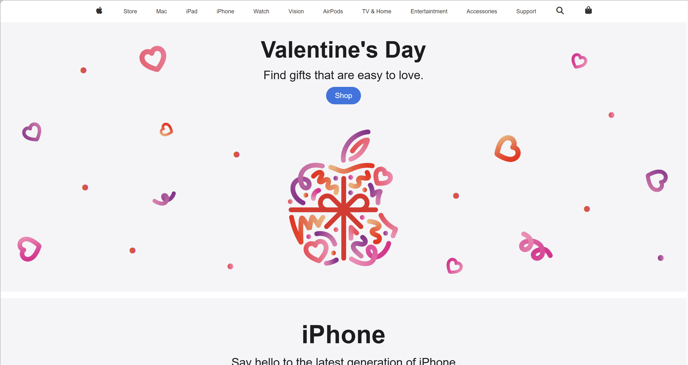

# Apple Landing Page Clone

This project is a simple Apple website landing page clone built using HTML and CSS.

## 🚀 Technologies Used

- HTML5
- CSS3

## 📁 Project Structure

apple site/
│── index.html
│── style.css
└── picture/

## 🎯 Purpose

This project was created to practice layout design and CSS positioning.

## 🌐 Live Demo

https://zeyneptiryaki.github.io/apple-site/

## 📸 Preview

## 📚 What I Learned

- Structuring a front-end project
- Using Git and GitHub
- Basic layout and styling techniques

---

Made with 💻 by Zeynep